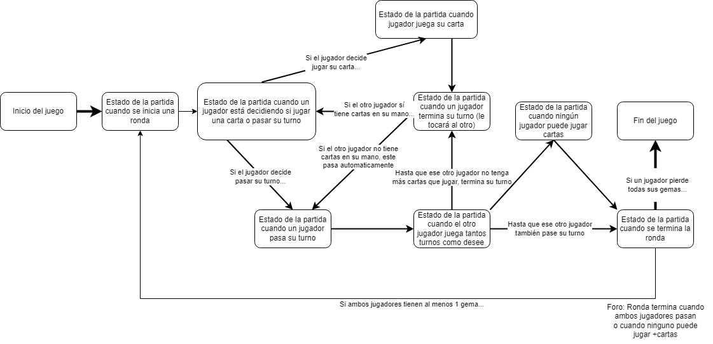

# Gwen't

This work is licensed under a
[Creative Commons Attribution 4.0 International License](http://creativecommons.org/licenses/by/4.0/)

**Contexto:**

Este repositorio corresponde al proyecto consistente en un clon (simplificado)
del juego de cartas [_Gwent_](https://www.playgwent.com/en) desarrollado por [_CD PROJEKT RED_](https://cdprojektred.com/en/) para su franquicia de videojuegos The Witcher.
A grandes rasgos el juego tendrá dos jugadores, uno controlado por el usuario y otro controlado por la computadora.
Cada jugador tendrá un mazo y una mano de cartas que puede jugar en un tablero en una partida al mejor de tres
rondas, según lo señalado en el documento [Enunciado Proyecto V1.0.2.pdf](https://www.u-cursos.cl/ingenieria/2023/1/CC3002/2/material_docente/detalle?id=6465061)
(en adelante, el "documento") en material docente del curso.

## Descripción
El desarrollo del proyecto se efectuó a lo largo de tres tareas, con sub entregas parciales. En estas se implementaron
las clases y métodos asociados al jugador del juego (ver sección 1.1 Jugador del documento), el cual se implementó como 
una interfaz Jugador, de la cual 
extienden las clases Usuario y Computadora. Con respecto a las cartas, las cartas de tipo unidad se implementaron 
como una clase abstracta, de la cual extienden las tres clases de tipo unidad (Asedio, Cuerpo y Distancia), y además
se implementaron las cartas de tipo Clima (ver sección 1.3 Cartas del documento). 
Además, ambos tipos de cartas poseen diversos efectos (ver más adelante en el presente readme, además de la sección 1.4
Efectos del documento). 
Después se hicieron las clases necesarias para modelar el tablero del juego, a través de una interfaz 
Tablero, en la cual  estarán las dos secciones simétricas del tablero, una para cada jugador (subdivididas en 
tres zonas asociadas a cada tipo de carta de unidad), además de la zona de clima (ver sección 1.2 Tablero del 
documento). Para el juego de las cartas  en sí, dependiendo de la zona en la que se juegue, 
se aplicó el patrón de diseño Double Dispatch.

Con respecto a las reglas del juego, se establecieron distintas fases de juegos siguiendo ciertas condiciones señaladas
en la sección 1.5 Reglas del juego del documento. Estas distintas fases, se implementaron como estados del juego 
(mostrados en la sección *Diagrama de estados*), 
para lo cual el patrón de diseño State fue ideal para esto.
Para manejar los efectos de las cartas, se usó el patrón de diseño Composite (ésto, inspirado en la Auxiliar
9 Patrones de Diseño II), según lo señalado en las secciones 1.5 Reglas del juego y 1.4 Efectos del documento.

## Diagrama de estados

